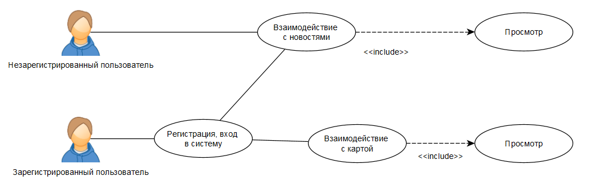
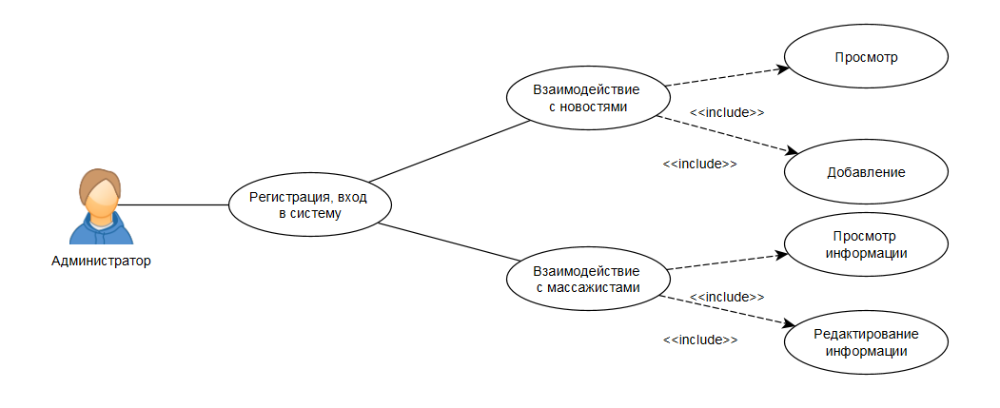
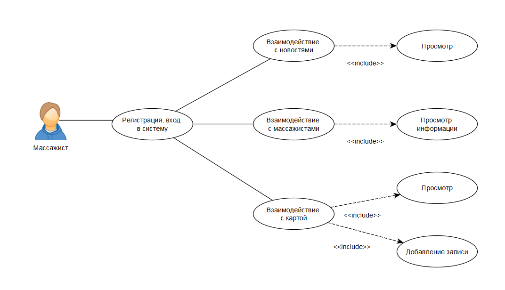

# web
# Цель работы:

Создать клиент-серверное приложение для массажного салона

# Краткий перечень функциональных требований:

1. регистрация
2. вход в систему
3. просмотр новостей
4. добавление новостей
5. просмотр информации о массажистах
6. редактирование информации о массажистах
7. просмотр карты клиента
8. добавление записи в карту клиента

# Use-case диаграмма системы:

# ER-диаграмма сущностей системы:

