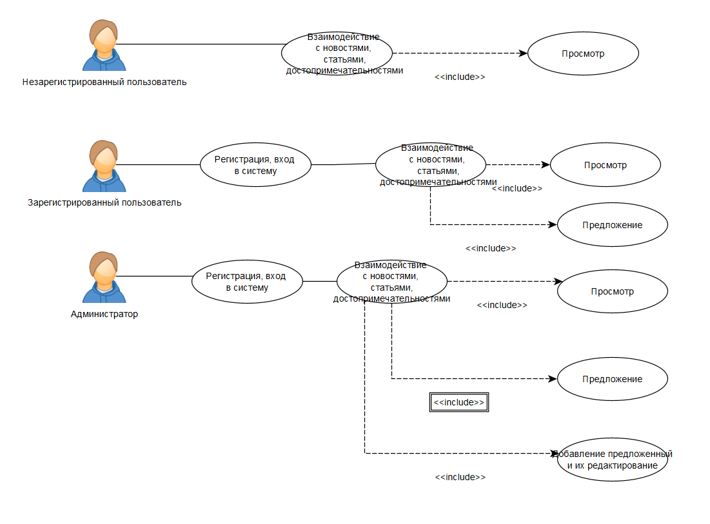

# web
# Цель работы:

Создать клиент-серверное приложение для массажного салона

# Краткий перечень функциональных требований:

регистрация
вход в систему
просмотр новостей
добавление новостей
просмотр информации о массажистах
редактирование информации о массажистах
просмотр карты клиента
добавление записи в карту клиента

# Use-case диаграмма системы:

